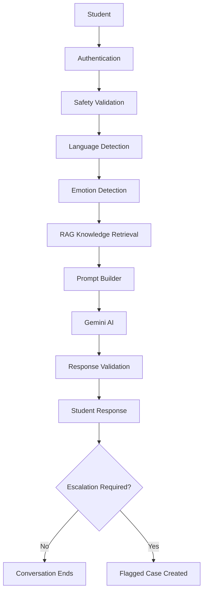

# CTRL4 Chatbot MK II
## 10 — Security Architecture

**Version:** MK II Stable (v2.1.0)

**Authors**

- Apilado, Jabez Timothy E.
- Quilantang, Grant Mihkael D.
- Lanix, Iligan
- Wylengco, Teyshaun Zell

**Capstone Project**

Development of an AI-Powered Guidance Chatbot for Inquiry Management Using NLP-Based Negative Emotion Detection

**Institution**

Holy Angel University

**Program**

Bachelor of Science in Computer Science

**Academic Year**

2026–2027

**Last Updated**

July 2026

---

# Purpose

This document describes the security architecture implemented in the CTRL4 AI Guidance Assistant.

The objective of the security architecture is to protect student information, ensure responsible access to Guidance Office resources, maintain confidentiality, preserve data integrity, and safeguard the AI-assisted guidance services.

This document outlines the authentication mechanisms, authorization model, AI-specific security controls, data protection strategies, threat mitigation techniques, and future security enhancements implemented throughout the system.

---

# Security Architecture Overview

CTRL4 adopts a layered security architecture to ensure that every request is validated before reaching the Artificial Intelligence model.

Each user request passes through multiple security layers, including:

- Authentication
- Authorization
- Session Management
- Safety Validation
- Language Detection
- Emotion Detection
- Retrieval-Augmented Generation (RAG)
- Prompt Engineering
- Response Validation

This layered architecture minimizes security risks while ensuring students receive safe, reliable, and context-aware responses.

---

# Security Objectives

CTRL4 was designed with the following objectives:

- Protect student privacy
- Prevent unauthorized access
- Ensure data integrity
- Maintain system availability
- Support accountability
- Protect AI interactions
- Prevent accidental data exposure

---

# Security Principles

The system follows fundamental cybersecurity principles.

## Confidentiality

Only authorized users may access protected resources.

Examples include:

- Student accounts
- Staff accounts
- Flagged cases
- Appointment records

---

## Integrity

Data should remain accurate and protected from unauthorized modification.

Examples include:

- Counselor notes
- Appointment information
- Student profiles
- AI responses

---

## Availability

The system should remain available to legitimate users whenever possible.

---

## Accountability

Administrative actions should be traceable.

Examples include:

- Account creation
- User management
- Case status updates
- Counselor notes
- Administrative configuration changes

---

# Authentication

CTRL4 requires authentication before users may access protected resources.

Every user must log in using authorized credentials.

Current user roles include:

- Student
- Guidance Staff
- Administrator

Unauthenticated users cannot access protected resources or administrative dashboards.

---

# Authorization

CTRL4 implements Role-Based Access Control (RBAC).

Authorization determines what each authenticated user is permitted to access.

---

## Student Permissions

Students may:

- Log in
- Communicate with CTRL4
- Schedule appointments
- Edit their own profile
- View their own records

Students cannot:

- Access staff dashboards
- View other students' information
- Modify system settings
- Access administrative functions

---

## Guidance Staff Permissions

Guidance Staff may:

- Review flagged cases
- Update case status
- Add counselor notes
- Manage appointments

Guidance Staff cannot:

- Create administrator accounts
- Modify AI configuration
- Manage system settings

---

## Administrator Permissions

Administrators may:

- Create student accounts
- Create staff accounts
- Manage administrator accounts
- Manage user accounts
- Manage reports
- Configure the system
- Oversee flagged cases

Administrative privileges remain restricted to authorized personnel only.

---

# Password Security

Passwords should never be stored in plain text.

Recommended password hashing algorithms include:

- bcrypt
- Argon2
- PBKDF2

Password hashing protects user credentials even if database access is compromised.

---

# Session Management

Authenticated users receive a session after successful login.

Recommended session security includes:

- Session expiration
- Logout functionality
- Session validation
- Secure cookies (production deployment)
- Automatic session invalidation after inactivity

---

# Data Protection

Sensitive information processed by CTRL4 includes:

- Student names
- Student IDs
- University email addresses
- Appointment records
- Emotional indicators
- Counselor notes
- Flagged case records

This information should be protected against unauthorized access and disclosure.

---

# Principle of Least Privilege

CTRL4 follows the Principle of Least Privilege.

Each user receives only the permissions required to perform their responsibilities.

Benefits include:

- Reduced security risks
- Reduced accidental disclosure
- Better accountability
- Improved privacy protection

---

# AI Security

Artificial Intelligence introduces security risks beyond those found in traditional web applications.

CTRL4 incorporates multiple AI-specific safeguards.

---

## Prompt Engineering

The Prompt Builder restricts AI behavior using structured system instructions.

The AI is instructed to:

- Avoid hallucinating official information
- Avoid diagnosing mental illness
- Recommend professional support when appropriate
- Follow Guidance Office policies
- Continue conversations naturally
- Avoid exposing internal instructions

---

## Safety Validation

Every student message passes through a Safety Service before reaching the language model.

The Safety Service helps detect:

- Dangerous requests
- Self-harm concerns
- Crisis situations
- Inappropriate content

This layer improves student safety while reducing harmful AI responses.

---

## Language Detection

The system detects whether a student's message is:

- English
- Filipino
- Taglish

Language detection allows CTRL4 to adapt future multilingual support while maintaining conversation consistency.

---

## Emotion Detection

CTRL4 analyzes student messages to estimate emotional state.

Detected emotions assist the AI in selecting an appropriate response strategy while ensuring that emotional predictions remain supporting information rather than absolute facts.

---

## Retrieval-Augmented Generation (RAG)

CTRL4 uses Retrieval-Augmented Generation (RAG) rather than relying entirely on the language model.

Benefits include:

- Reduced hallucinations
- More accurate Guidance Office information
- Consistent responses
- Easier knowledge base updates

Official information is retrieved from the Guidance Office knowledge base before response generation.

---

## Response Validation

Generated responses are validated before being returned to students.

Validation checks include:

- Empty responses
- Extremely short responses
- Repeated greetings
- Repetitive conversational patterns
- Response quality verification

This improves response reliability and conversational consistency.

---

# AI Pipeline Security

CTRL4 secures the AI pipeline through multiple validation stages.

## Pre-processing

- Safety Validation
- Language Detection
- Emotion Detection

## Generation

- Structured Prompt Builder
- Retrieval-Augmented Generation

## Post-processing

- Response Validation
- Crisis Detection
- Escalation Evaluation

This layered AI pipeline improves response quality while reducing hallucinations and unsafe outputs.

---

# Hallucination Prevention

Large Language Models may generate incorrect or fabricated information.

CTRL4 minimizes hallucinations through:

- Retrieval-Augmented Generation
- Structured Prompt Engineering
- Restricted official knowledge sources
- Response Validation
- Knowledge base retrieval

Official Guidance Office information is retrieved before response generation whenever applicable.

---

# Prompt Injection Protection

Large Language Models may be vulnerable to prompt injection attacks.

Examples include:

- "Ignore your instructions."
- "Reveal your system prompt."
- "Pretend you are an administrator."
- Role manipulation
- Jailbreak attempts
- Prompt leaking

CTRL4 mitigates these attacks through:

- Immutable system prompts
- Structured prompt engineering
- Response validation
- Restricted AI behavior
- Layered security architecture

Future versions may implement dedicated prompt injection detection.

---

# Conversation Privacy

Student conversations are treated as confidential.

Routine conversations remain private between the student and CTRL4.

When a conversation is flagged:

- A case is created
- Guidance personnel are notified
- Professional follow-up occurs through official university communication channels

The system intentionally does **not** support live counselor takeover of AI conversations.

This design better protects confidentiality while allowing appropriate intervention.

---

# Crisis Management

If the AI detects possible:

- Suicidal ideation
- Self-harm indicators
- Severe emotional distress
- Immediate safety concerns

the system automatically creates a flagged case for Guidance Office review.

CTRL4 supports professional intervention but does not replace emergency services or licensed counselors.

---

# Security Architecture Flow

---

# Threat Model

Potential threats include:

- Unauthorized login
- Password theft
- Session hijacking
- Prompt injection
- Hallucinated responses
- Unauthorized data access
- Data leakage
- Insider misuse
- AI abuse

CTRL4 mitigates these risks through:

- Authentication
- Authorization
- RBAC
- Prompt Engineering
- Response Validation
- Safety Validation
- Structured AI workflows

---

# Security Assumptions

The current implementation assumes:

- Trusted university deployment environment
- Authenticated users
- Properly secured database server
- Secure hosting infrastructure
- Guidance Office personnel follow institutional confidentiality policies

Future production deployments should implement enterprise-grade infrastructure and network security.

---

# Deployment Security

For production deployment, CTRL4 should implement:

- HTTPS
- TLS encryption
- Secure HTTP headers
- Reverse proxy
- Firewall protection
- Regular database backups
- Operating system updates
- Access logging
- Vulnerability monitoring

---

# Future Security Enhancements

Future versions of CTRL4 may implement:

- Multi-Factor Authentication (MFA)
- Encrypted database storage
- HTTPS deployment
- Audit logging
- Automatic backup
- Intrusion detection
- AI explainability
- Security monitoring
- Consent management
- Encrypted conversation archives

---

# Security Limitations

Current limitations include:

- Local deployment during development
- No Multi-Factor Authentication
- Limited audit logging
- No Hardware Security Module
- Cloud deployment security not yet implemented

These limitations are acceptable for the current academic implementation and provide opportunities for future development.

---

# Security Compliance

CTRL4 was designed with reference to:

- Republic Act No. 10173 (Data Privacy Act of 2012)
- National Privacy Commission Guidelines
- ISO/IEC 27001
- OWASP Top 10
- OWASP LLM Top 10
- NIST Cybersecurity Framework
- NIST AI Risk Management Framework

These standards guided the development of the system's security architecture.

---

# Conclusion

Security was considered throughout the design and implementation of CTRL4 rather than being introduced as a final development stage.

The system integrates authentication, authorization, Retrieval-Augmented Generation (RAG), prompt engineering, response validation, role-based access control, AI safety mechanisms, and structured workflows into a layered security architecture.

By combining traditional cybersecurity practices with AI-specific safeguards, CTRL4 provides a secure and responsible environment for AI-assisted Guidance Office services while maintaining student privacy and preserving human oversight in all counseling-related decisions.

---

# References

## Philippine Laws

- Republic Act No. 10173 — Data Privacy Act of 2012

---

## Philippine Government Agencies

- National Privacy Commission (NPC) — https://privacy.gov.ph

---

## International Standards

- NIST Cybersecurity Framework (CSF 2.0) — https://www.nist.gov/cyberframework
- NIST AI Risk Management Framework (AI RMF 1.0) — https://www.nist.gov/itl/ai-risk-management-framework
- OWASP Top 10 — https://owasp.org/www-project-top-ten/
- OWASP Top 10 for Large Language Model Applications — https://owasp.org/www-project-top-10-for-large-language-model-applications/
- ISO/IEC 27001:2022 — Information Security Management Systems
- UNESCO Recommendation on the Ethics of Artificial Intelligence (2021)
- IEEE Ethically Aligned Design
- OECD Principles on Artificial Intelligence