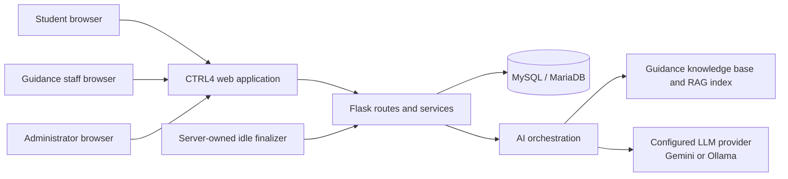
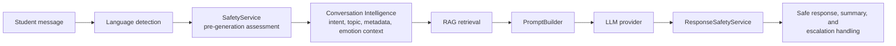
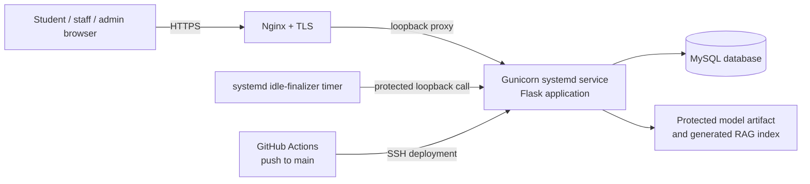

# CTRL4 Chatbot MK III — Technical Architecture

This document describes the implemented technical architecture of the CTRL4
Guidance Office Chatbot System. It is a concise system-level reference for the
student chatbot, Guidance Office workflows, system administration, AI
processing, and production operation. Detailed security, API, and deployment
requirements remain in their dedicated documents.

> **Scope and source of truth.** This reference describes the tracked
> implementation and the supported production topology. It deliberately omits
> credentials, private records, model weights, and generated RAG index files.
> Follow the repository contributor instructions and the Deployment Guide for
> operational changes.

## 1. Architecture at a glance

CTRL4 is a web-based Guidance Office support system with three authenticated
roles: **students**, **Guidance Office staff**, and **administrators (ITSS)**.
It uses a Flask application, a MySQL or MariaDB database, an English
DistilBERT emotion-context model, Retrieval-Augmented Generation (RAG), and a
provider-based large language model service.



The implementation is organized around five connected pillars:

| Pillar | Responsibility |
| --- | --- |
| **AI Chatbot** | Gives students a guided conversational interface for approved Guidance Office information, support, and appointment-related requests. |
| **Conversation Intelligence and Safety** | Processes language, intent, topic, emotion context, warning signs, crisis risk, summaries, and response validation. |
| **Student Support Services** | Supports appointments, case review items, referrals, counselor interventions, and follow-up records. |
| **Guidance Office Operations** | Provides program-scoped inbox, flagged-case, appointment, feedback, reporting, notification, and settings views for authorized staff. |
| **System Administration** | Provides account and program management while keeping administrators outside guidance-specific records and workflows. |

## 2. Layered application design

CTRL4 follows the required ownership boundary below.

```text
Frontend  →  Route  →  Service  →  Database
```

| Layer | Main location | Owns |
| --- | --- | --- |
| **Frontend** | `frontend/templates/`, `frontend/static/` | Presentation, responsive interaction, safe rendering, and client-side advisory validation. |
| **Routes** | `backend/server/routes/` | HTTP parsing, request validation, authentication and role checks, Flask session lifecycle, status codes, boundary logging, and response serialization. |
| **Services** | `backend/server/services/` | Business validation, appointment and case workflows, privacy projections, notifications, settings, account rules, and AI orchestration. |
| **Database helpers** | `backend/server/db.py` and `backend/sql/schema.sql` | Parameterized persistence, retrieval, transactions, integrity safeguards, and schema initialization. |

The Flask application is created in `backend/app.py` through
`backend/server/__init__.py`. Long-lived AI services are composed once through
`backend/server/services/__init__.py` and reused by route-driven workflows.

## 3. User roles and access boundaries

| Role | Authorized responsibilities | Explicit boundary |
| --- | --- | --- |
| **Student** | Sign in, accept Terms and Conditions, use the chatbot, submit optional reply feedback, manage own appointments, view own privacy-safe status, and read own notifications. | Cannot view other students, staff records, internal notes, prompts, raw retained chat records, or operational configuration. |
| **Guidance staff** | Review authorized program-scoped inbox and flagged cases, record case actions, manage routed appointments, view reports, review feedback, and manage approved office or personal staff settings. | Access is program-scoped and does not grant unrestricted student or staff data access. |
| **Administrator (ITSS)** | Manage accounts, credentials, roles, activation status, and the program catalog. | Does not receive counseling, escalation, appointment, raw conversation, case-summary, or Guidance Office workflow authority. |

Authentication uses server-side Flask sessions rather than browser-stored JWTs.
Students have one active device lease at a time: a replacement sign-in requires
confirmation and safely finalizes the prior active student conversation. Staff
and administrators may sign in on multiple devices. Terms acknowledgement,
CSRF controls, server-side authorization, and ownership checks remain enforced
by the backend.

## 4. Core application modules

### 4.1 Student chatbot and appointment experience

The student-facing interface provides the authenticated chat, optional reply
feedback, case-status view, notifications, and appointment actions. The
appointment workflow supports booking, viewing, rescheduling, and cancelling
only the student's own appointments. Counselor routing is dynamic and
program-based; CTRL4 does not persist a default counselor as the owner of each
student.

### 4.2 Conversation, safety, and case management

The system creates a staff-visible active conversation item after a student's
first stored message. When a conversation is finalized through logout,
completion, session replacement, or the server-owned idle finalizer, CTRL4
updates the same reviewable item with a counselor-oriented AI summary and
approved metadata rather than creating a duplicate.

Staff see privacy-safe summary projections. Raw chat history is temporary and
is cleared after conversation finalization; it is not exposed through student
or staff APIs. Pending flagged cases remain visible to authorized staff until
reviewed. Reviewed flagged history remains available without changing the
ordinary Inbox workflow.

### 4.3 Guidance Office operations

Authorized staff use the dashboard to manage program-scoped inbox items,
flagged cases, counselor notes, confidentiality handling, referrals,
interventions, appointments, notifications, chatbot feedback, reports, and
settings. Global Office settings are distinguished from staff-specific
availability, consultation modes, appointment start slots, profile, and
account-security settings.

### 4.4 Account and program administration

Administrators manage accounts and the program catalog. Student self-
registration is an optional, time-limited survey feature controlled by
production-only environment configuration; it is disabled by default and can
only create student accounts with an approved student-registration code.

## 5. AI processing pipeline

The AI flow is ordered deliberately. Each student message follows this
sequence:



| Component | Function |
| --- | --- |
| **Language Service** | Supports English, Filipino, and Taglish response processing. |
| **SafetyService** | Performs the authoritative pre-generation assessment for crisis, self-harm, harm to others, abuse, approved warning signs, and escalation. Crisis handling bypasses ordinary duplicate-response prevention and generic fallback behavior. |
| **Conversation Intelligence** | Combines intent, topic, metadata, temporary conversational context, and emotion context to guide an appropriate response. |
| **Emotion Service** | Uses the deployed English DistilBERT classifier as an emotional-context signal. It is not a clinical diagnostic tool and is not the authority for escalation. |
| **RAG Service** | Retrieves approved Guidance Office knowledge-base content through the configured FAISS-backed index. |
| **PromptBuilder and LLM Service** | Constructs the approved context and calls the configured Gemini or Ollama provider through the provider abstraction. |
| **ResponseSafetyService** | Validates generated text and replaces an unsafe generated response as a whole. It does not expose blocked generated content. |

For explicit immediate safety risk, the SafetyService returns the safety
response and creates the appropriate escalation workflow before ordinary
response variation or duplicate-response controls can apply. Warning-sign and
review-only cases can be made staff-visible without being represented as a
clinical diagnosis or an automatic emergency.

## 6. Data architecture and privacy model

The relational schema is maintained in `backend/sql/schema.sql` and aligned
with `backend/server/db.py`. Its principal entities include:

| Data group | Examples of stored entities | Purpose |
| --- | --- | --- |
| **Identity and access** | `accounts`, `settings` | Role-bound identity, account status, program assignment, and approved settings. |
| **Conversation review** | `inquiries`, `conversation_summaries`, `escalations`, `case_notes` | Reviewable conversation metadata, summaries, flags, and authorized follow-up. |
| **Case actions** | `referrals`, `referral_notes`, `referral_status_history`, `interventions`, `intervention_history`, `case_confidentiality`, `case_confidentiality_history` | Guidance Office case-management and confidentiality actions. |
| **Student support** | `appointments`, `notifications` | Appointment lifecycle and recipient-scoped in-app notices. |
| **Quality feedback** | `chatbot_feedback` | Student rating category, optional note, safe reply-context category, and response hash; it does not retain raw student messages or AI reply text. |

Privacy is implemented through minimum disclosure and service-owned
projections:

- The system does not make raw student chat transcripts durable after
  finalization and never returns them to staff dashboard APIs.
- Staff work from authorized summaries, risk metadata, and documented case
  actions rather than unrestricted chat contents.
- Notification records are recipient-scoped and are explicitly marked read.
- Feedback records do not store raw chat transcripts or full generated replies.
- Administrators are excluded from guidance-specific data and workflow views.

## 7. Production deployment architecture

The supported production topology is a single CTRL4 application instance on
the Contabo VPS. The production domain is `socguidance.online` and HTTPS is
terminated by Nginx.



Production responsibilities are separated as follows:

- **Nginx** terminates HTTPS and proxies the public domain to Gunicorn on the
  loopback interface.
- **Gunicorn and systemd** run and supervise the Flask application.
- **MySQL** stores persistent operational data separately from application
  source code.
- **Protected local assets** include the production `backend/.env`, the
  validated English model artifact, and generated RAG index files. Source
  deployments preserve these operational assets.
- **The idle-finalizer timer** calls a protected loopback maintenance endpoint
  to finalize genuinely inactive student chats after the configured inactivity
  period.
- **GitHub Actions** deploys pushes to `main` by pulling the tracked source on
  the VPS, verifying the model artifact, restarting the service, and checking
  the local health endpoint.

Production secrets, database credentials, HTTPS private keys, model weights,
and generated RAG artifacts are not committed to Git.

## 8. Repository layout

```text
CTRL4_Chatbot/
├── backend/
│   ├── app.py                    Flask entry point
│   ├── server/
│   │   ├── routes/               HTTP and authorization boundaries
│   │   ├── services/             Domain and AI orchestration services
│   │   ├── auth.py               Server-side session ownership
│   │   └── db.py                 Parameterized persistence helpers
│   ├── sql/schema.sql            Relational schema
│   └── scripts/                  Setup, verification, and operational scripts
├── frontend/
│   ├── templates/                Flask-rendered HTML templates
│   └── static/                   CSS, JavaScript, images, and client assets
├── ai_engine/
│   ├── knowledge_base/           Approved knowledge-base source records
│   ├── models/                   Model release layout; weights are operational assets
│   └── core/                     AI-engine support code
├── docs/                         Architecture, deployment, user, model, and research docs
├── scripts/                      Local operational helper scripts
├── tests/                        Automated regression and fixture-based tests
└── .github/workflows/            GitHub Actions production deployment workflow
```

## 9. Architectural constraints and non-goals

- CTRL4 is a Guidance Office support and inquiry-management system, not a
  clinical diagnostic, treatment, or emergency-response replacement.
- Safety assessment and staff escalation remain authoritative system rules;
  LLM text and emotion classification do not replace human judgment.
- The current emotion classifier is English-based. Filipino and Taglish are
  supported by language and safety processing, but a separately trained and
  validated Filipino or Taglish emotion classifier remains future work.
- The current production session backend is filesystem-backed CacheLib. The
  supported topology is one application instance until an approved shared
  session backend is introduced.
- New external notification channels, background reminder workflows,
  persistent raw-transcript retention, or administrator access to guidance
  records are outside the current architecture.

## 10. Related documentation

- [Project Architecture](project_architecture.md) — detailed current workflow
  and domain-boundary reference.
- [Security Architecture](security_architecture.md) — authentication, RBAC,
  privacy, browser safety, and security constraints.
- [API Reference](api_reference.md) — route-derived page and JSON API contracts.
- [Deployment Guide](../deployment/deployment_guide.md) — authoritative VPS,
  database, model, RAG, health-check, recovery, and deployment procedure.
- [Model and Evaluation Provenance](../models/README.md) — English emotion
  model lineage and held-out evaluation records.
